# RPG 2D game "Knigght"

## Description:
2D top-down RPG game is a dynamic adventure full of action,
where players choose one of three available character 
classes and set out to hunt down enemies and interact 
with NPCs. During the game, players will have the chance 
to develop their characters, gain new experience and items 
to defeat increasingly powerful enemies. 
The goal of the game is to defeat a powerful Boss,
who is the final obstacle before achieving ultimate power.
Will you be able to face the challenges and defeat the Boss?
Play and find out!

## Available character classes:
The game features three character classes

    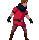
    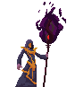
    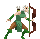

## Opponents in the game:
The game contains five types of enemies

    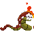
    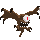
    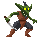
    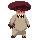
    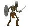

## NCPs:
The game contains three types of NPCs

    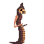
    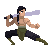
    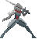

## Executables:
### Windows

win_exe_file/RPG.exe

### MacOS

unix_exe_file/game

## How to run game:
Running the game may require additional SFML libraries

### MacOS
Run the file located in the "unix_exe_file" folder

$ ./game

The file may require additional permissions, for this purpose use the command:

$ chmod 754 ./game

### Windows
Run the RPG.exe file located in the "win_exe_file" folder

## Game scenes:

    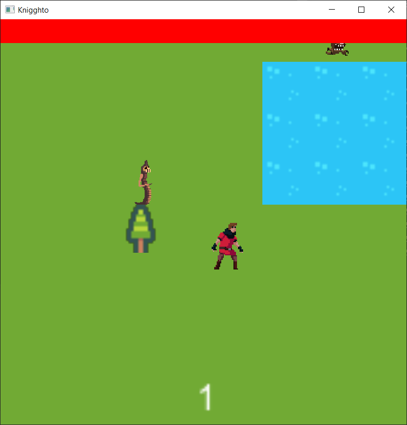
    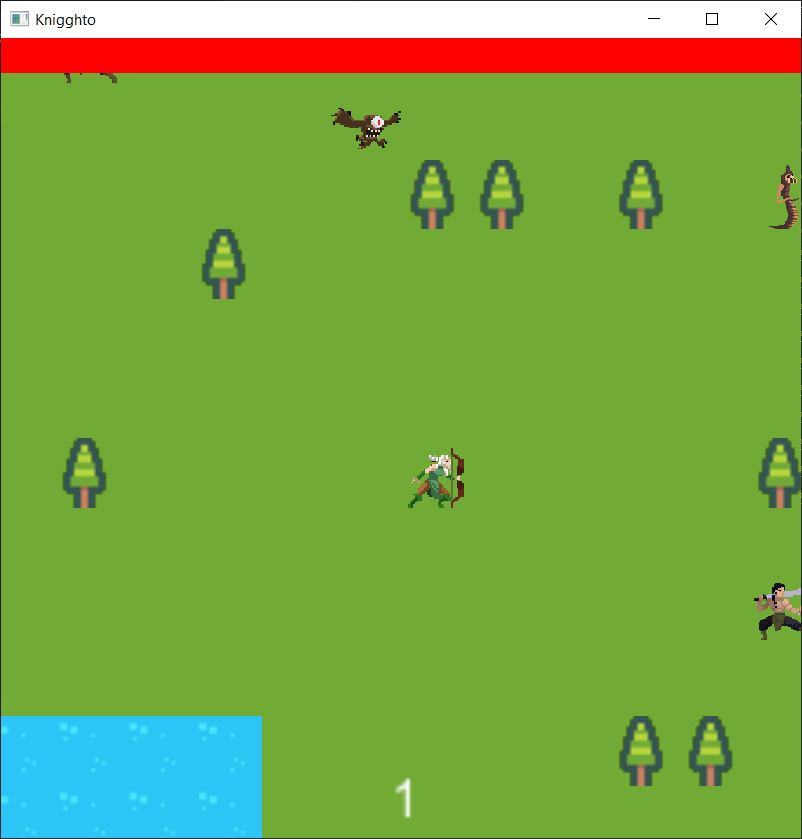
    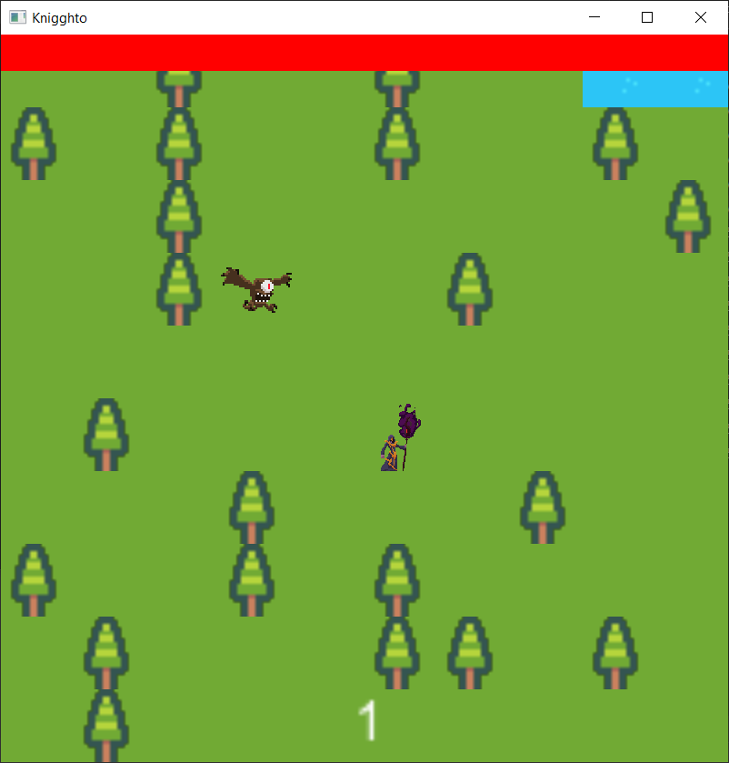

